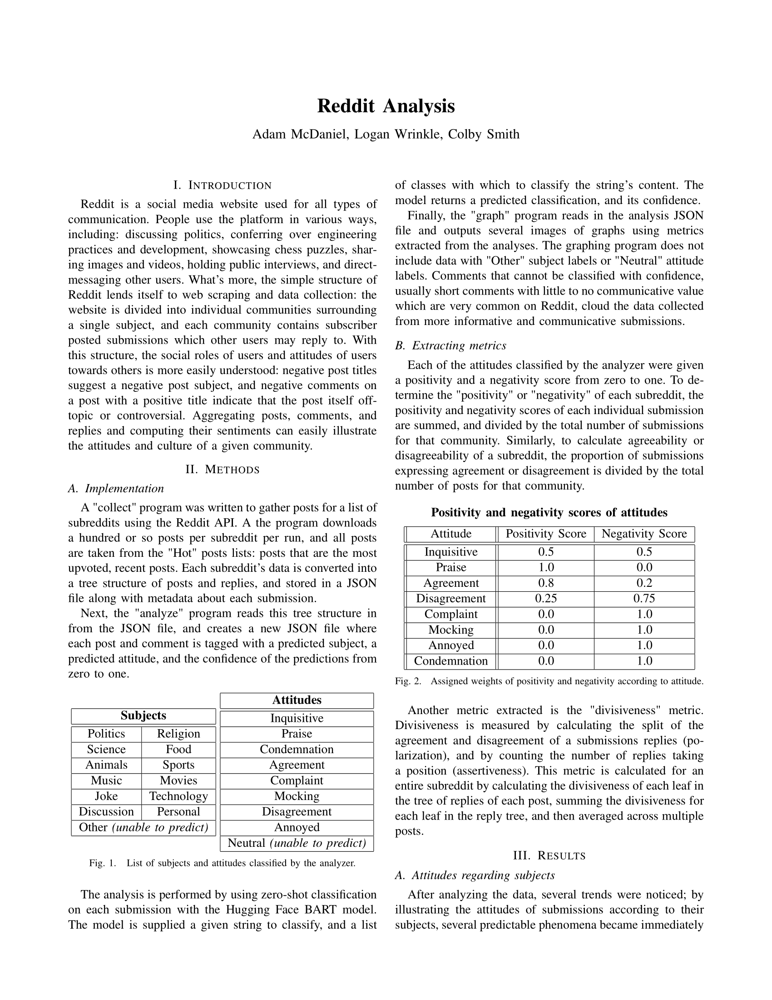
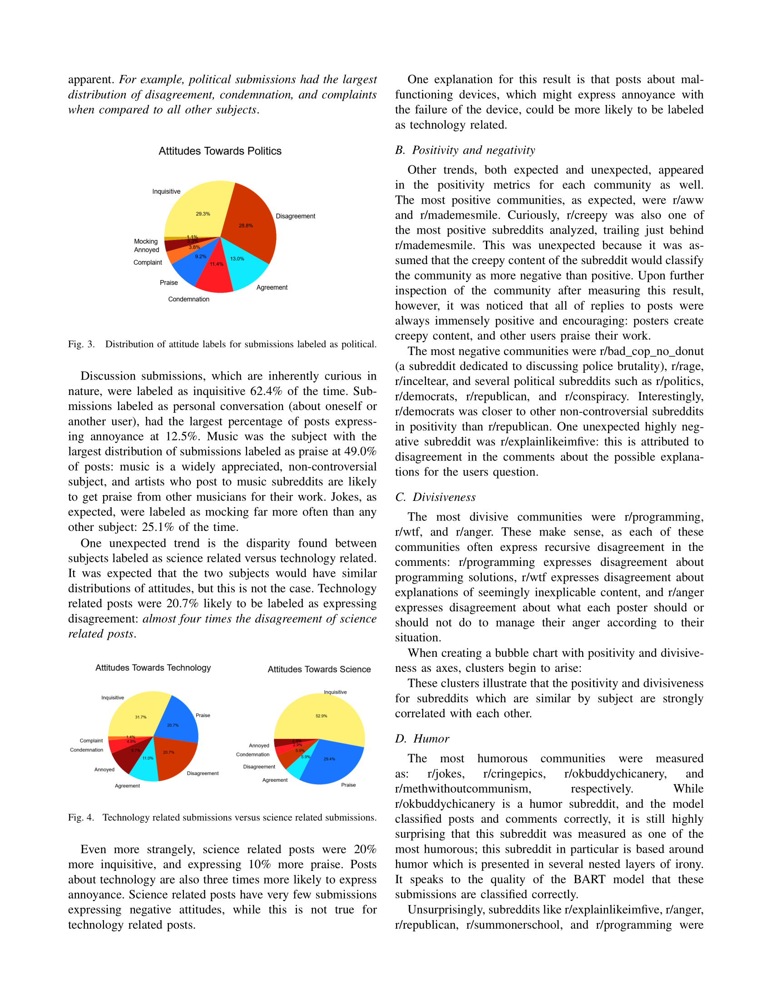
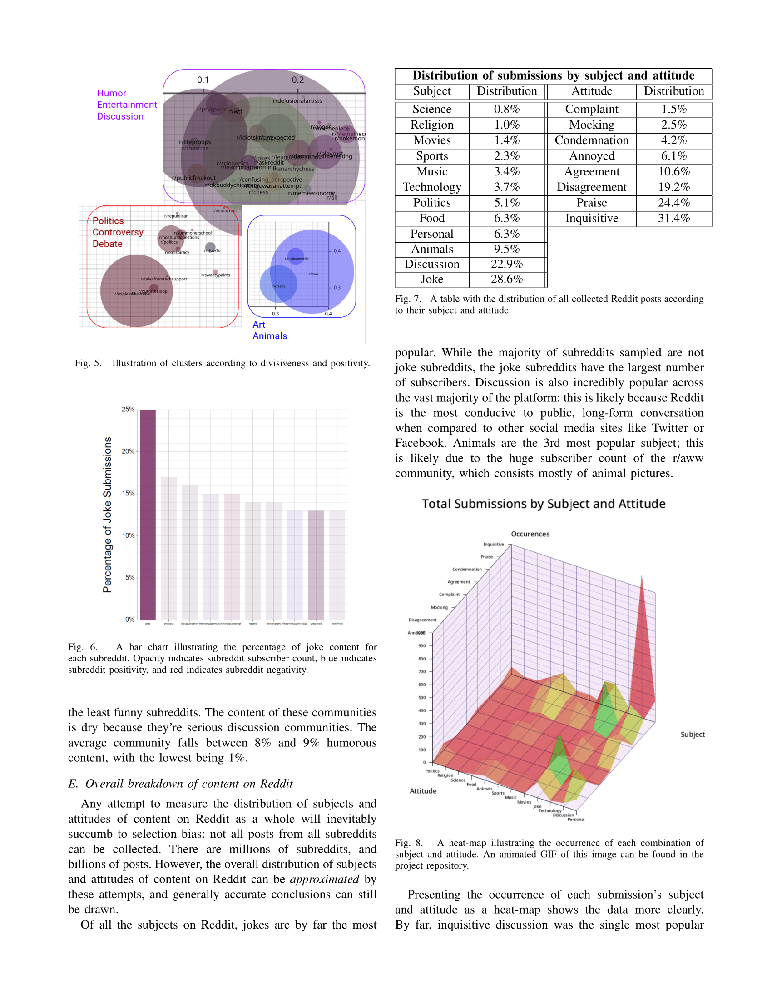
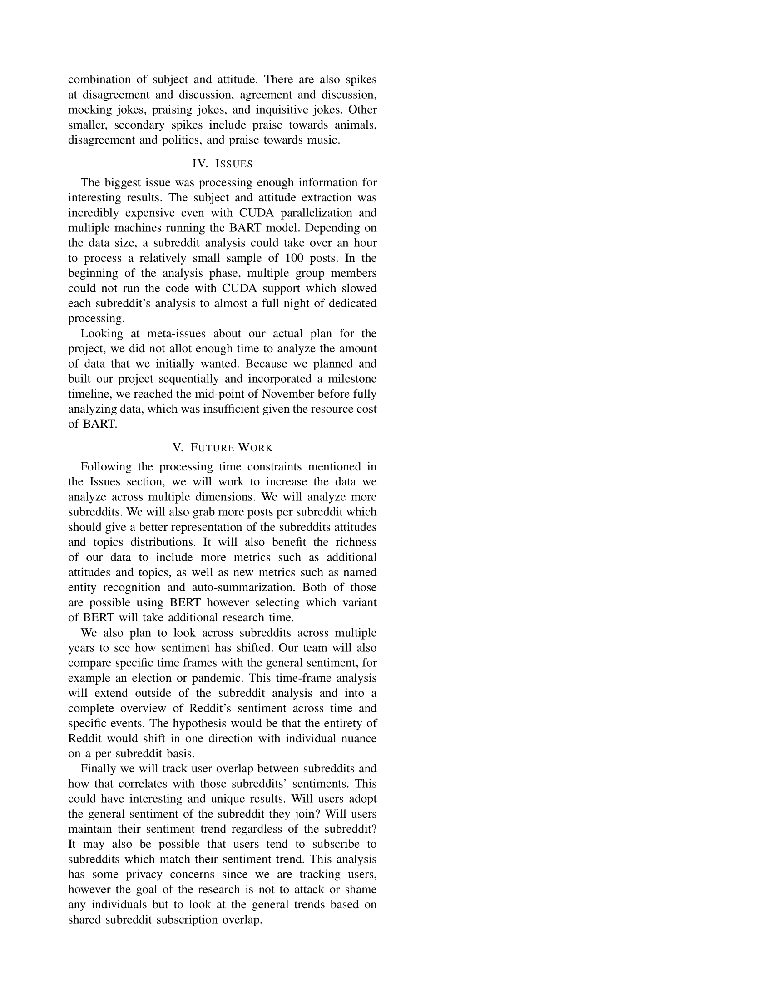
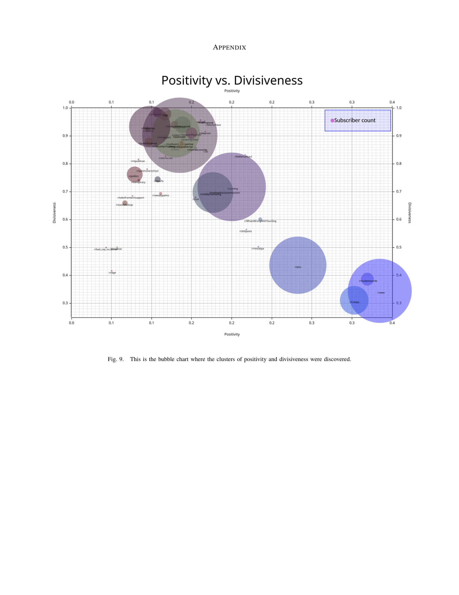
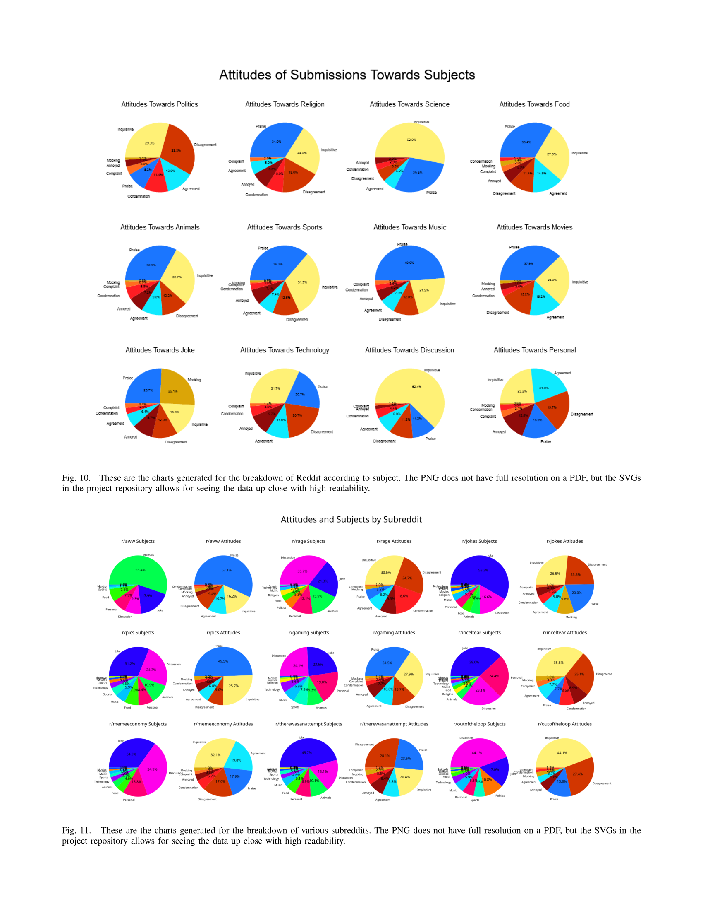
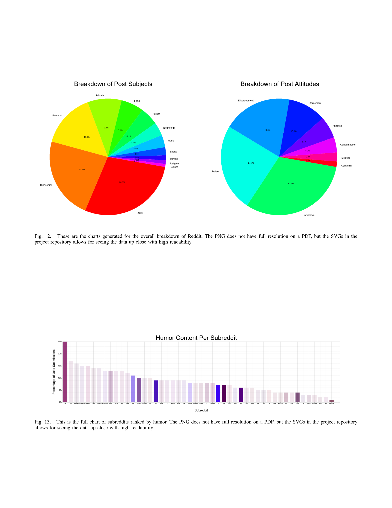

# reddit-analysis

This is a project that I helped create for COSC 545 Digital Archeaology, a data science course. We scraped reddit, performed sentiment analysis on the content using BERT, and found relationships between subreddits and somes patterns of the attitudes of their users.

